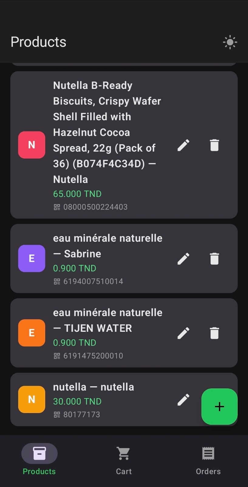
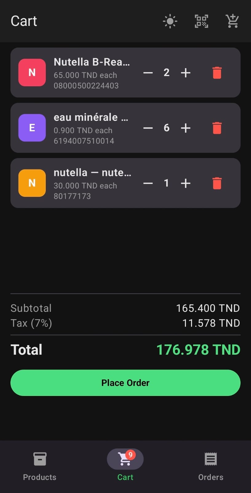
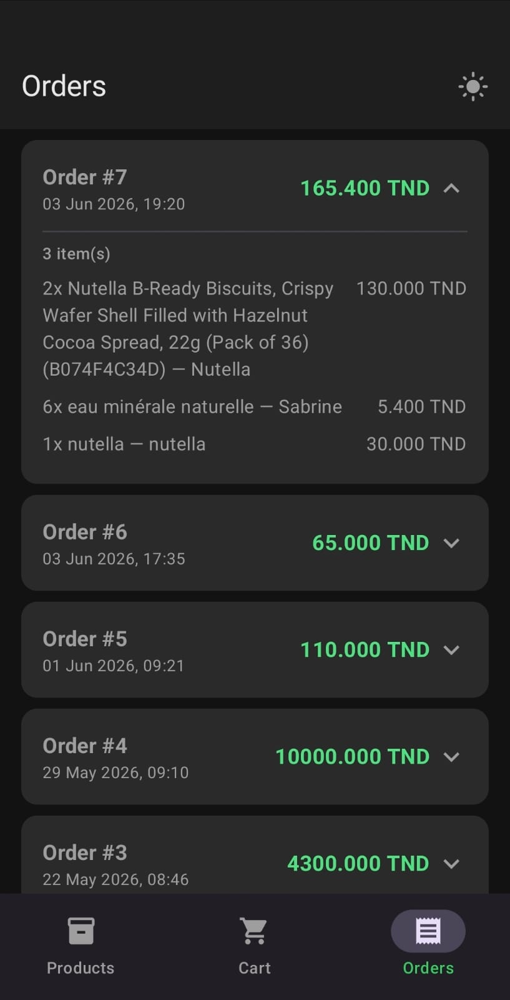
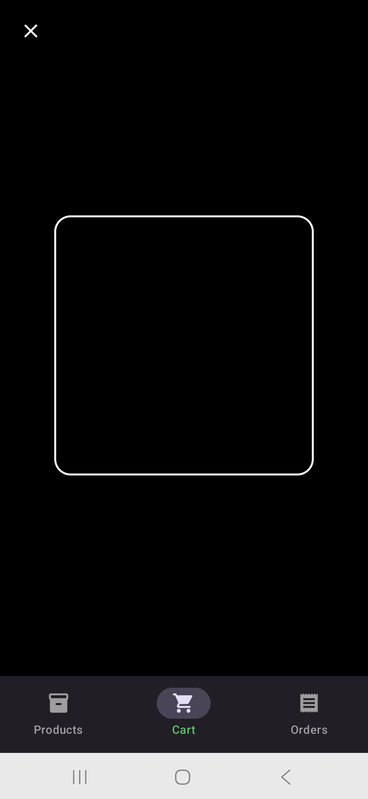
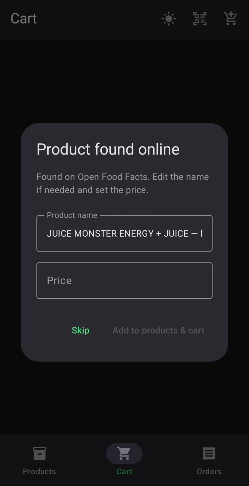
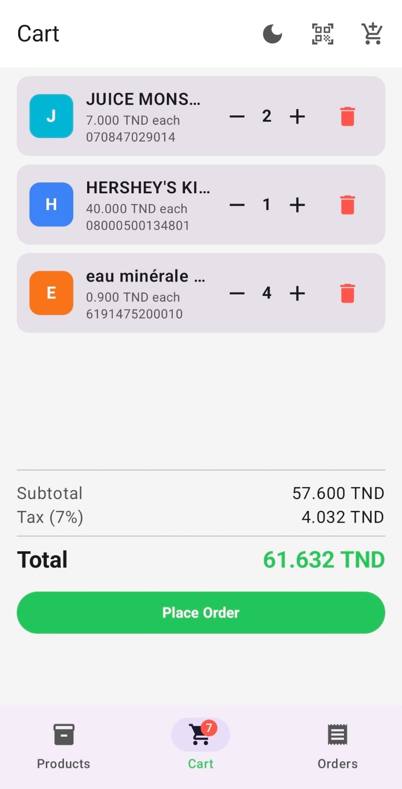

# KotlinPOS

A modern **Point of Sale** Android app built with Kotlin and Jetpack Compose. Scan real-world barcodes, manage your product catalog, and track orders — all in a clean dark-themed UI with light mode support.


---

## Screenshots

<p align="center">
  
  &nbsp;
  
  &nbsp;
  
</p>
<p align="center">
  <em>Products &nbsp;&nbsp;·&nbsp;&nbsp; Cart &nbsp;&nbsp;·&nbsp;&nbsp; Orders</em>
</p>

<p align="center">
  
  &nbsp;
  
  &nbsp;
  
</p>
<p align="center">
  <em>Barcode Scanner &nbsp;&nbsp;·&nbsp;&nbsp; Online Lookup &nbsp;&nbsp;·&nbsp;&nbsp; Light Mode</em>
</p>

---

## Features

- **Barcode Scanning** — real-time scanning via CameraX + ML Kit; works on any product barcode
- **Online Product Lookup** — automatic lookup via Open Food Facts with two fallback APIs (UPC Item DB, Open Products Facts); product name auto-filled from the database
- **Manual Add** — when a barcode isn't found online, a dialog lets you add it manually
- **Cart Management** — add, remove, and adjust quantities; per-item colored avatar, price, and barcode displayed
- **Order Summary** — subtotal, 7% tax, and grand total shown before placing
- **Product Catalog** — full CRUD for your local product list with barcode assignment
- **Order History** — expandable order cards with per-item breakdown and timestamp
- **Dark / Light Mode** — toggle from the top bar on any screen
- **Offline-first** — all data stored locally with Room; network only used for barcode lookup
- **TND Currency** — prices displayed in Tunisian Dinar (3 decimal places)

---

## Tech Stack

| Area | Technology |
|---|---|
| Language | Kotlin |
| UI | Jetpack Compose · Material3 |
| Architecture | MVVM + Clean Architecture |
| Dependency Injection | Hilt |
| Local Database | Room |
| Camera | CameraX |
| Barcode Recognition | ML Kit Barcode Scanning |
| Networking | Retrofit 2 · OkHttp |
| Asynchronous | Kotlin Coroutines · StateFlow |
| Navigation | Navigation Compose |

---

## Architecture

The project follows **Clean Architecture** with three distinct layers:

```
app/
├── data/
│   ├── local/          # Room database, DAOs, entities
│   ├── remote/         # Retrofit API services, response DTOs
│   └── repository/     # Repository implementations
│
├── domain/
│   ├── model/          # Business models (Product, Order, CartItem…)
│   ├── repository/     # Repository interfaces
│   └── usecase/        # One use case per business action
│
├── presentation/
│   ├── checkout/       # Cart screen + barcode scanner + ViewModel
│   ├── orders/         # Order history screen + ViewModel
│   ├── products/       # Product catalog screen + ViewModel
│   └── ui/theme/       # Material3 dark & light color schemes
│
└── di/                 # Hilt modules
```

**Data flow:** UI → ViewModel (StateFlow) → UseCase → Repository → Room / Retrofit

---

## Getting Started

### Requirements

- Android Studio Iguana (2023.2) or later
- Android device or emulator with **API 26+**
- Physical device recommended for barcode scanning

### Run

```bash
git clone https://github.com/abir739/kotlin-pos-app.git
```

Open in Android Studio, let Gradle sync, then run on a device or emulator.

> Barcode scanning requires a camera. A physical device gives the best results; the emulator camera works but may struggle with real barcodes.

### Barcode Lookup

The app queries three public APIs in sequence — no API key required:

1. [Open Food Facts](https://world.openfoodfacts.org/) — food & grocery products
2. [UPC Item DB](https://www.upcitemdb.com/) — electronics & retail
3. [Open Products Facts](https://world.openproductsfacts.org/) — general products

If none find the barcode, a dialog lets you enter the product details manually.
